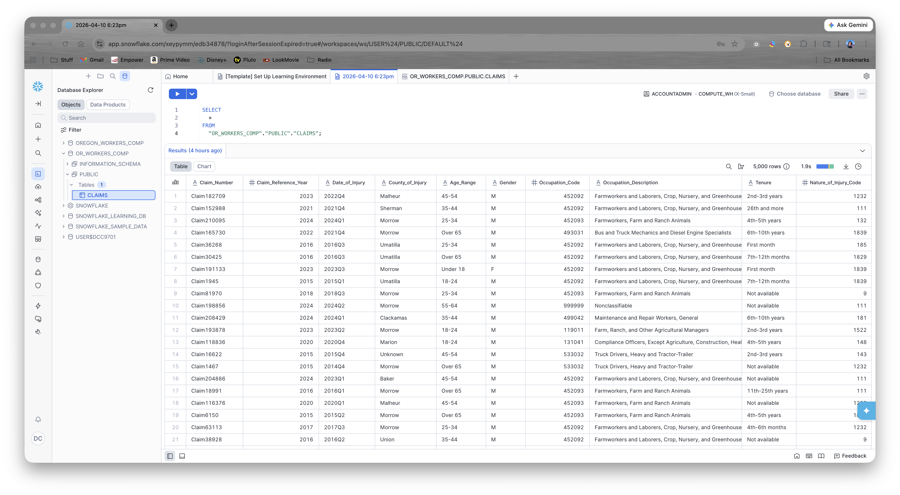
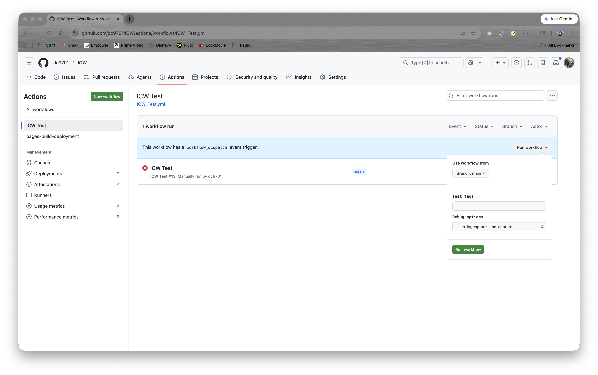
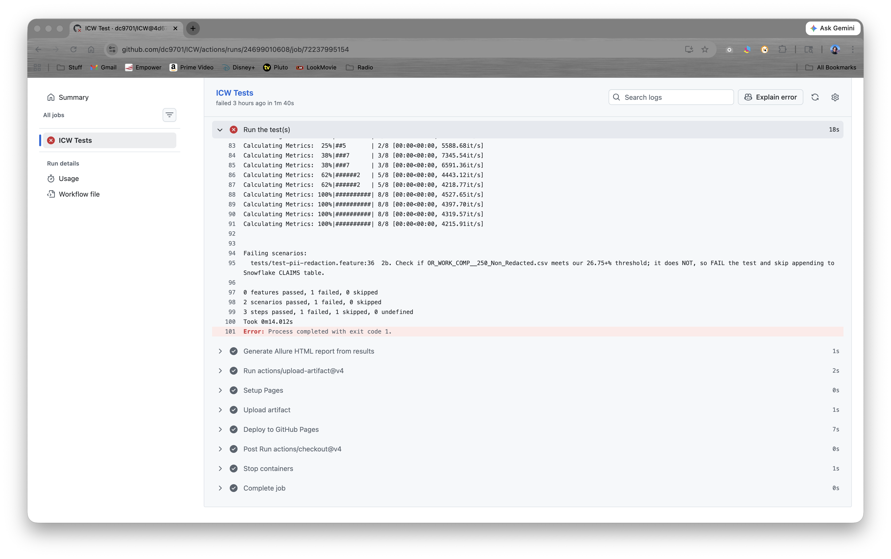

# ICW - Data Integrity Check Before Ingestion to Snowflake

In meeting with Sanjeev earlier this month, we discussed how to use open source automation tools and AI to migrate from ICW's legacy SQL backend to Snowflake.  Thinking further, I put together this PoC to demonstrate a possible solution.

### SAMPLE DATA

To begin, I needed a P&C-related set - nothing complex to begin with, just enough for a Data Quality (DQ) check before ingestion.  I found a public domain workman's compensation claims table in CSV format with some 220,300K rows, which I reduced to 5,000 to save time:

**https://catalog.data.gov/dataset/oregon-workers-compensation-record-level-claims**

`resources/data/OR_WORK_COMP__5000_Clean_Import.csv`

I set up a Snowflake account for myself and imported the data:



### OPEN SOURCE DQ TOOLS

A little research of Data Quality tools showed **[Soda Core 4.0](https://soda.io/blog/introducing-soda-4.0)** and **[Great Expectations (GX) Core](https://docs.greatexpectations.io/docs/core/introduction/)** both to be capable tools, but **Soda Core** seemed geared more towards a cloud subscription model.  I chose **GX Core** for it's python libraries, Snowflake connectors, community support, and price point (free).

### PROJECT OVERVIEW

Using the **GX Core** and **Snowflake** libraries, we can ingest data and validate data integrity at the table level or with **pandas** to verify import_file content before ingestion.  That is what our test case does:
```
    # test-pii-redaction.feature
    #
    # Description: Verify redaction of PII in CLAIMS table meets threshold.
    #
    # 1. Setup:
    #   a. Connect to the OR_WORKERS_COMP.PUBLIC Snowflake database.
    #   b. Setup clean test data by replacing CLAIMS table w/ data from OR_WORK_COMP__5000_Clean_Import.csv.
    #
    # 2. Test scenarios:
    #   a. Verify our baseline PII data (Employer_Name) is redacted in AT LEAST 26.75% of the rows.
    #   b. Before importing 250 non-redacted rows, verify the PII check FAILS (now < 26.75%).
```
I used a BDD approach to make test design clearer and easier to maintain, with `common_steps.py` doing all the heavy lifting.  While you can run the test locally once you have all the python packages installed, it's easier to just run the GitHub Actions workflow (you'll need to login to Github):





As expected, the first two test scenarios pass, but Scenario 2b FAILS, since the CSV import file does not match our data quality expectation (Employer Name is redacted in greater than 26.75% of the rows).  With 2b failing, the final **Then I append data...** step is SKIPPED, meaning our Snowflake production tables are left uncorrupted.

```
    Scenario: 1. SETUP: Connect to Snowflake and set up clean test data.
        Given I am connected to OR_WORKERS_COMP database
        And I replace the CLAIMS table with data from OR_WORK_COMP__5000_Clean_Import.csv

    Scenario: 2a. Verify our baseline PII data (Employer_Name) is 'Redacted' in AT LEAST 26.75% of the rows.
        Then I verify the Employer_Name column in the CLAIMS table is Redacted for at least 26.75% of the rows

    Scenario: 2b. Check if OR_WORK_COMP__250_Non_Redacted.csv meets our 26.75+% threshold; it does NOT, so FAIL the test and skip appending to Snowflake CLAIMS table.
        # NOTE: The "appended data to the CLAIMS table" step will be SKIPPED if the verification fails, preventing ingestion of bad data.
        When I verify OR_WORK_COMP__250_Non_Redacted.csv has a Employer_Name column that is Redacted for at least 26.75% of the rows
        Then I append data to the CLAIMS table from OR_WORK_COMP__250_Non_Redacted.csv
```

In `common_steps.py`, you can see the details of how the import file is validated BEFORE any data gets appended to the production CLAIMS table:
```
@step("I verify {import_file} has a {column} column that is {value} for at least {percent}% of the rows")
def step_then_verify_import_file_has_column_value_for_percent_of_rows(context, import_file, column, value, percent):
    """
    Validate at least ##.##% of the rows match the specified value in the import file.

    Args:
        context:     Behave context object.
        import_file: Import filenam without path (e.g., OR_WORK_COMP__5000_Clean_Import.csv)
                        assumes path: 'resources/data/'.
        column:      Column name, case-sensitive (Employer_Name).
        value:       Value to match in column.   
        percent:     Percent as a decimal ##.##, converted to 0.####.
    """
    if '/' not in import_file:
        import_file = f"../resources/data/{import_file}"

    # We import the CSV content and validate the dataframe directly, without adding data to Snowflake.
    import_dataframe = pd.read_csv(import_file)
    data_source = context.properties.gx_context.data_sources.add_or_update_pandas(name="pandas_datasource")
    data_asset = data_source.add_dataframe_asset(name="import_data")
    batch_request = data_asset.build_batch_request({"dataframe": import_dataframe})

    validator = context.properties.gx_context.get_validator(
        batch_request=batch_request
    )
    result = validator.expect_column_values_to_be_in_set(
        column=column,
        value_set=[value],
        mostly=float(percent) / 100
    )
    assert result.success == True, f"The {column} column does NOT match '{value}' for at least {percent}% of the rows in {import_file}"
```
### A NOTE ON AI

Using both Google's Gemini "AI Mode" in some searches and CoPilot (GPT-4.1 or Claude Haiku 4.5) for code generation, I find the results something of a coin toss.  Half the time it would steer me in the right direction where I could drill down and find a solution sooner.  Other times, it would reference deprecated syntax or sample code with erroneous dependencies, and I'd end up going down rabbit holes I should have avoided altogether.

For example, the deprecated `context.sources.add_snowflake(...)` would keep coming up, even in auto-complete prompts.  It wasn't until I really READ the warnings in my logs (old school!) that I disovered the error:

```
DeprecationWarning: add_or_update_datasource() from the DataContext is deprecated and will be removed in a future version of GX. Please use `context.data_sources.add_or_update` instead.
```

<br>

___

I hope you found this little PoC informative!

-- David Cooper